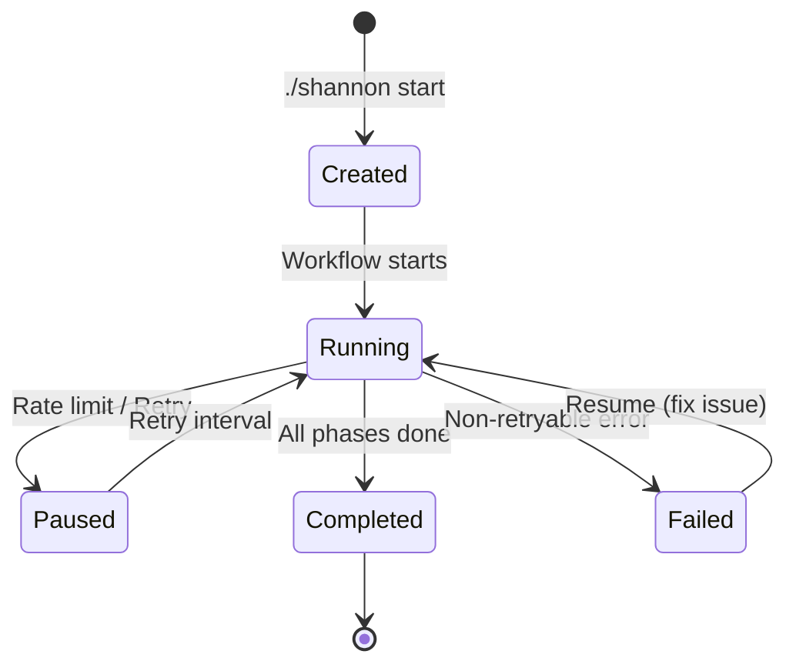

The `workspaces` command displays all Shannon workspaces, including their status, completion state, and metadata. This is essential for managing multiple pentests and resuming interrupted workflows.

## Basic Usage

```bash
./shannon workspaces
```

No parameters required. The command automatically:

1. Ensures Shannon containers are running
2. Queries Temporal for all workflows
3. Loads workspace metadata from audit logs
4. Displays workspace status and progress

## Output Format

The command displays a formatted table with workspace information:

```bash
$ ./shannon workspaces

Shannon Workspaces:

┌─────────────────────┬──────────────────────┬────────────┬─────────────┬──────────────┐
│ Workspace           │ URL                  │ Status     │ Completed   │ Last Updated │
├─────────────────────┼──────────────────────┼────────────┼─────────────┼──────────────┤
│ q1-2024-audit       │ https://example.com  │ Running    │ 3/5 agents  │ 2 hours ago  │
│ juice-shop-test     │ http://localhost:3000│ Completed  │ 5/5 agents  │ 1 day ago    │
│ prod-security-scan  │ https://app.acme.com │ Failed     │ 2/5 agents  │ 3 hours ago  │
└─────────────────────┴──────────────────────┴────────────┴─────────────┴──────────────┘

Resume a workspace:
  ./shannon start URL=<url> REPO=<repo> WORKSPACE=<name>
```

## Workspace Types

### Named Workspaces

Created when you specify `WORKSPACE=<name>`:

```bash
# Create named workspace
./shannon start URL=https://example.com REPO=my-repo WORKSPACE=q1-audit

# View workspaces
./shannon workspaces
# Shows: q1-audit

# Resume named workspace
./shannon start URL=https://example.com REPO=my-repo WORKSPACE=q1-audit
```

**Benefits:**
- Easy to identify and resume
- Descriptive names (e.g., "q1-2024-audit", "pre-release-scan")
- Ideal for long-running or scheduled audits

### Auto-Named Workspaces

Created automatically when `WORKSPACE` is not specified:

```bash
# Start without WORKSPACE parameter
./shannon start URL=https://example.com REPO=my-repo

# View workspaces
./shannon workspaces
# Shows: example.com_shannon-1234567890

# Resume using auto-generated name
./shannon start URL=https://example.com REPO=my-repo \
  WORKSPACE=example.com_shannon-1234567890
```

**Format:** `<hostname>_shannon-<timestamp>`

## Workspace Status

### Running

Workflow is actively executing:

```
Status: Running
Completed: 3/5 agents
Current: vuln-analysis (injection, xss, auth)
```

**Actions:**
- Monitor with `./shannon logs ID=<workspace-id>`
- View in Temporal UI: http://localhost:8233
- Wait for completion or stop with `./shannon stop`

### Completed

All phases finished successfully:

```
Status: Completed
Completed: 5/5 agents
Report: repos/<repo>/deliverables/comprehensive_security_assessment_report.md
```

**Actions:**
- Review deliverables in `repos/<repo>/deliverables/`
- Analyze audit logs in `audit-logs/<workspace-id>/`
- Run new pentest if target has changed

### Failed

Workflow encountered non-retryable error:

```
Status: Failed
Completed: 2/5 agents
Error: AuthenticationError - Invalid API key
```

**Actions:**
- Check error details in `audit-logs/<workspace-id>/workflow.log`
- Fix configuration issues (API keys, credentials)
- Resume from last successful agent

### Paused (Rate Limited)

Workflow waiting for rate limit recovery:

```
Status: Paused
Completed: 3/5 agents
Retry: Next attempt in 15 minutes (rate limit recovery)
```

**Actions:**
- Wait for automatic retry
- Temporal will resume when rate limit clears
- No manual intervention needed

## Workspace Metadata

Each workspace stores metadata in `audit-logs/<workspace-id>/session.json`:

```json
{
  "workspaceId": "q1-audit",
  "workflowId": "q1-audit_shannon-1234567890",
  "targetUrl": "https://example.com",
  "repositoryPath": "/repos/my-repo",
  "startTime": "2024-03-05T10:00:00Z",
  "completedAgents": ["pre-recon", "recon", "injection-vuln"],
  "status": "running",
  "metrics": {
    "totalTokens": 1250000,
    "totalCost": 18.75,
    "duration": 7200
  }
}
```

## Resuming Workspaces

When you resume a workspace, Shannon:

1. **Validates workspace exists** - Checks `session.json` and deliverables
2. **Loads completed agents** - Skips already-finished agents
3. **Verifies deliverables** - Ensures previous outputs are valid
4. **Restores git checkpoints** - Returns repository to previous state
5. **Continues from checkpoint** - Resumes at first incomplete agent

### Resume Example

```bash
# Initial run (interrupted after 2 agents)
./shannon start URL=https://example.com REPO=my-repo WORKSPACE=audit-1
# Completed: pre-recon, recon
# Interrupted at: injection-vuln

# Resume workflow
./shannon start URL=https://example.com REPO=my-repo WORKSPACE=audit-1

# Output:
# Resuming workspace: audit-1
# Found completed agents:
#   ✓ pre-recon
#   ✓ recon
# Skipping 2 agents
# Starting from: injection-vuln
# Workflow resumed: audit-1_resume_1234567890
```

### Resume Validation

Shannon performs safety checks before resuming:

<AccordionGroup>
  <Accordion title="Deliverable Verification">
    Checks that each completed agent has valid deliverable files:
    
    ```
    Checking deliverables:
      ✓ pre_recon_deliverable.md (valid)
      ✓ recon_deliverable.md (valid)
      ✗ injection_analysis_deliverable.md (missing)
    
    Error: Deliverable missing for injection-vuln
    Will re-run agent: injection-vuln
    ```
  </Accordion>
  
  <Accordion title="Git Checkpoint Restoration">
    Restores repository state from previous run:
    
    ```
    Restoring git checkpoint...
    Reset branch: shannon-audit-1
    Restored to commit: abc123
    ```
  </Accordion>
  
  <Accordion title="Incomplete Deliverable Cleanup">
    Removes partial or corrupted deliverables:
    
    ```
    Cleaning incomplete deliverables:
      Removed: injection_analysis_deliverable.md (corrupted)
    ```
  </Accordion>
</AccordionGroup>

See [Workspaces & Resume](/advanced/workspaces-resume) for detailed workflow.

## Workspace Lifecycle



## Managing Workspaces

### List All Workspaces

```bash
./shannon workspaces
```

### View Workspace Logs

```bash
# Find workspace ID from workspaces list
./shannon workspaces

# Tail logs for specific workspace
./shannon logs ID=q1-audit_shannon-1234567890
```

### Query Workspace Progress

Via Temporal Web UI:

1. Open http://localhost:8233
2. Find workflow by workspace ID
3. Click "Query" tab
4. Run `getProgress` query
5. View detailed progress JSON

### Clean Up Workspaces

Workspace data is preserved until manually deleted:

```bash
# Stop containers (preserves workspace data)
./shannon stop

# Remove all data including workspaces
./shannon stop CLEAN=true

# Or manually delete workspace
rm -rf audit-logs/<workspace-id>
```

<Warning>
  `./shannon stop CLEAN=true` removes **all** workspaces and their data permanently.
  Back up important audit logs and deliverables first.
</Warning>

## Integration with Other Commands

### Start → Workspaces → Logs

Typical workflow monitoring pattern:

```bash
# 1. Start pentest
./shannon start URL=https://example.com REPO=my-repo WORKSPACE=audit

# 2. List workspaces to check status
./shannon workspaces

# 3. Tail logs for detailed progress
./shannon logs ID=audit_shannon-1234567890
```

### Workspaces → Resume

Resume interrupted or failed workflows:

```bash
# 1. Check workspace status
./shannon workspaces
# Shows: audit-1 (Failed, 2/5 agents)

# 2. Fix issue (update .env, fix config, etc.)

# 3. Resume workflow
./shannon start URL=https://example.com REPO=my-repo WORKSPACE=audit-1
```

## Output Location

Workspace data is stored in:

```
audit-logs/<workspace-id>/
├── session.json              # Workspace metadata
├── workflow.log              # Human-readable log
├── pre-recon/
│   ├── prompt.txt
│   ├── agent.log
│   └── metrics.json
└── ...
```

Customize output location with `OUTPUT` parameter:

```bash
./shannon start URL=https://example.com REPO=my-repo \
  OUTPUT=./security-audits

# Workspaces stored in: ./security-audits/<workspace-id>/
```

## Next Steps

<CardGroup cols={2}>
  <Card title="Resume Workflows" icon="rotate" href="/advanced/workspaces-resume">
    Learn advanced workspace resume strategies
  </Card>
  <Card title="View Logs" icon="file-lines" href="/cli/logs">
    Monitor workflow execution in real-time
  </Card>
  <Card title="Query Progress" icon="magnifying-glass" href="/cli/query">
    Query detailed workflow state
  </Card>
  <Card title="Start Command" icon="play" href="/cli/start">
    Options for starting workflows
  </Card>
</CardGroup>