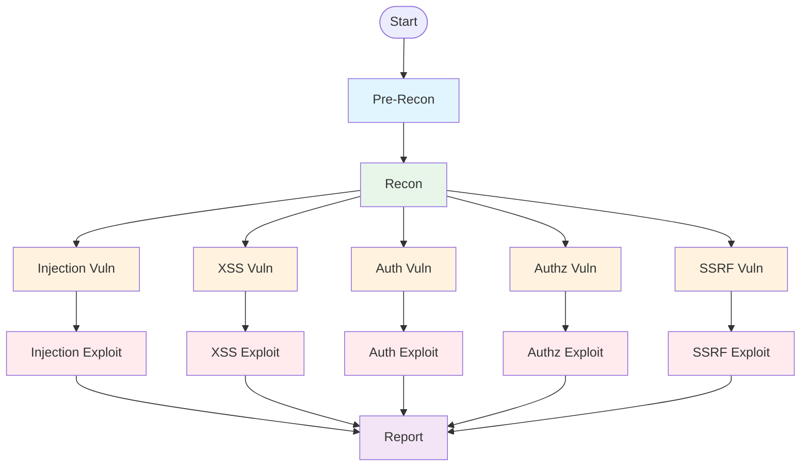

## Overview

Shannon's agent system is the core of its autonomous testing capability. Each agent is a specialized AI instance powered by Claude, designed for a specific security testing task. The system coordinates 13 agents across 5 phases, with sophisticated parallel execution and dependency management.

## Agent Registry

All agents are defined in a centralized registry that serves as the single source of truth:

**File**: `src/session-manager.ts:14-108`

```typescript
export const AGENTS: Readonly<Record<AgentName, AgentDefinition>> = Object.freeze({
  'pre-recon': {
    name: 'pre-recon',
    displayName: 'Pre-recon agent',
    prerequisites: [],
    promptTemplate: 'pre-recon-code',
    deliverableFilename: 'code_analysis_deliverable.md',
    modelTier: 'large',
  },
  'recon': {
    name: 'recon',
    displayName: 'Recon agent',
    prerequisites: ['pre-recon'],
    promptTemplate: 'recon',
    deliverableFilename: 'recon_deliverable.md',
  },
  // ... 11 more agents
});
```

## Agent Definition Structure

<ParamField path="name" type="AgentName" required>
  Unique identifier for the agent (e.g., `'injection-vuln'`, `'xss-exploit'`)
</ParamField>

<ParamField path="displayName" type="string" required>
  Human-readable name for logging and UI display
</ParamField>

<ParamField path="prerequisites" type="AgentName[]" required>
  Array of agent names that must complete before this agent runs. Empty array `[]` means no prerequisites.
</ParamField>

<ParamField path="promptTemplate" type="string" required>
  Filename (without extension) of the prompt template in `/prompts/` directory
</ParamField>

<ParamField path="deliverableFilename" type="string" required>
  Expected output filename that the agent must produce. Used for validation.
</ParamField>

<ParamField path="modelTier" type="'small' | 'medium' | 'large'" default="medium">
  Which Claude model tier to use:
  - `small`: Claude Haiku (fast, cost-efficient)
  - `medium`: Claude Sonnet (balanced, default)
  - `large`: Claude Opus (deep reasoning)
</ParamField>

## Complete Agent List

<AccordionGroup>
  <Accordion title="Phase 1: Pre-Reconnaissance (1 agent)">
    ### pre-recon

    - **Prerequisites**: None (runs first)
    - **Model**: Large (Claude Opus)
    - **Purpose**: Source code analysis + external reconnaissance
    - **Deliverable**: `code_analysis_deliverable.md`
    - **Prompt**: `prompts/pre-recon-code.txt`

    This is the foundation agent that analyzes the codebase and runs external tools like nmap, subfinder, and whatweb.
  </Accordion>

  <Accordion title="Phase 2: Reconnaissance (1 agent)">
    ### recon

    - **Prerequisites**: `pre-recon`
    - **Model**: Medium (default)
    - **Purpose**: Live application exploration and attack surface mapping
    - **Deliverable**: `recon_deliverable.md`
    - **Prompt**: `prompts/recon.txt`

    Uses browser automation to validate and expand on pre-recon findings.
  </Accordion>

  <Accordion title="Phase 3: Vulnerability Analysis (5 agents)">
    All vulnerability agents run **in parallel** after recon completes:

    ### injection-vuln
    - **Prerequisites**: `recon`
    - **Focus**: SQL Injection, Command Injection, NoSQL Injection
    - **Deliverable**: `injection_analysis_deliverable.md`
    - **Prompt**: `prompts/vuln-injection.txt`

    ### xss-vuln
    - **Prerequisites**: `recon`
    - **Focus**: Stored/Reflected/DOM XSS
    - **Deliverable**: `xss_analysis_deliverable.md`
    - **Prompt**: `prompts/vuln-xss.txt`

    ### auth-vuln
    - **Prerequisites**: `recon`
    - **Focus**: Broken Authentication
    - **Deliverable**: `auth_analysis_deliverable.md`
    - **Prompt**: `prompts/vuln-auth.txt`

    ### authz-vuln
    - **Prerequisites**: `recon`
    - **Focus**: Broken Authorization, IDOR
    - **Deliverable**: `authz_analysis_deliverable.md`
    - **Prompt**: `prompts/vuln-authz.txt`

    ### ssrf-vuln
    - **Prerequisites**: `recon`
    - **Focus**: Server-Side Request Forgery
    - **Deliverable**: `ssrf_analysis_deliverable.md`
    - **Prompt**: `prompts/vuln-ssrf.txt`
  </Accordion>

  <Accordion title="Phase 4: Exploitation (5 agents)">
    Each exploitation agent runs **conditionally** after its corresponding vulnerability agent:

    ### injection-exploit
    - **Prerequisites**: `injection-vuln`
    - **Deliverable**: `injection_exploitation_evidence.md`
    - **Prompt**: `prompts/exploit-injection.txt`

    ### xss-exploit
    - **Prerequisites**: `xss-vuln`
    - **Deliverable**: `xss_exploitation_evidence.md`
    - **Prompt**: `prompts/exploit-xss.txt`

    ### auth-exploit
    - **Prerequisites**: `auth-vuln`
    - **Deliverable**: `auth_exploitation_evidence.md`
    - **Prompt**: `prompts/exploit-auth.txt`

    ### authz-exploit
    - **Prerequisites**: `authz-vuln`
    - **Deliverable**: `authz_exploitation_evidence.md`
    - **Prompt**: `prompts/exploit-authz.txt`

    ### ssrf-exploit
    - **Prerequisites**: `ssrf-vuln`
    - **Deliverable**: `ssrf_exploitation_evidence.md`
    - **Prompt**: `prompts/exploit-ssrf.txt`

    <Warning>
      Exploitation agents only run if their vulnerability analysis agent found actionable issues in the exploitation queue.
    </Warning>
  </Accordion>

  <Accordion title="Phase 5: Reporting (1 agent)">
    ### report

    - **Prerequisites**: All 5 exploit agents
    - **Model**: Small (Claude Haiku)
    - **Purpose**: Consolidate findings into final report
    - **Deliverable**: `comprehensive_security_assessment_report.md`
    - **Prompt**: `prompts/report-executive.txt`

    Waits for all exploitation to complete before generating the final report.
  </Accordion>
</AccordionGroup>

## Agent Type System

Shannon uses TypeScript's type system to ensure type safety:

**File**: `src/types/agents.ts`

```typescript
// Canonical list of all agents
export const ALL_AGENTS = [
  'pre-recon',
  'recon',
  'injection-vuln',
  'xss-vuln',
  'auth-vuln',
  'ssrf-vuln',
  'authz-vuln',
  'injection-exploit',
  'xss-exploit',
  'auth-exploit',
  'ssrf-exploit',
  'authz-exploit',
  'report',
] as const;

// Derive type from array to prevent drift
export type AgentName = typeof ALL_AGENTS[number];

export interface AgentDefinition {
  name: AgentName;
  displayName: string;
  prerequisites: AgentName[];
  promptTemplate: string;
  deliverableFilename: string;
  modelTier?: 'small' | 'medium' | 'large';
}
```

## Parallel Execution

Shannon maximizes efficiency through intelligent parallel execution:

### Execution Model



### Concurrency Control

By default, all 5 vuln/exploit pipelines run concurrently. You can limit concurrency to reduce API usage:

```yaml
pipeline:
  max_concurrent_pipelines: 2  # Run 2 of 5 at a time
```

**Implementation**: `src/temporal/workflows.ts:338-363`

```typescript
async function runWithConcurrencyLimit(
  thunks: Array<() => Promise<VulnExploitPipelineResult>>,
  limit: number
): Promise<PromiseSettledResult<VulnExploitPipelineResult>[]> {
  const results: PromiseSettledResult<VulnExploitPipelineResult>[] = [];
  const inFlight = new Set<Promise<void>>();

  for (const thunk of thunks) {
    const slot = thunk().then(
      (value) => { results.push({ status: 'fulfilled', value }); },
      (reason: unknown) => { results.push({ status: 'rejected', reason }); }
    ).finally(() => { inFlight.delete(slot); });

    inFlight.add(slot);

    if (inFlight.size >= limit) {
      await Promise.race(inFlight);
    }
  }

  await Promise.allSettled(inFlight);
  return results;
}
```

### Browser Isolation

To prevent conflicts, each parallel agent gets its own Playwright browser instance:

**File**: `src/session-manager.ts:152-181`

```typescript
export const MCP_AGENT_MAPPING: Record<string, PlaywrightAgent> = {
  // Phase 3: Vulnerability Analysis (5 isolated browsers)
  'vuln-injection': 'playwright-agent1',
  'vuln-xss': 'playwright-agent2',
  'vuln-auth': 'playwright-agent3',
  'vuln-ssrf': 'playwright-agent4',
  'vuln-authz': 'playwright-agent5',
  
  // Phase 4: Exploitation (reuses same browsers as vuln phase)
  'exploit-injection': 'playwright-agent1',
  'exploit-xss': 'playwright-agent2',
  'exploit-auth': 'playwright-agent3',
  'exploit-ssrf': 'playwright-agent4',
  'exploit-authz': 'playwright-agent5',
};
```

## Agent Validators

Each agent has a validator function that checks if its deliverable was successfully created:

**File**: `src/session-manager.ts:184-227`

```typescript
export const AGENT_VALIDATORS: Record<AgentName, AgentValidator> = {
  'pre-recon': async (sourceDir: string): Promise<boolean> => {
    const codeAnalysisFile = path.join(sourceDir, 'deliverables', 'code_analysis_deliverable.md');
    return await fs.pathExists(codeAnalysisFile);
  },
  
  'recon': async (sourceDir: string): Promise<boolean> => {
    const reconFile = path.join(sourceDir, 'deliverables', 'recon_deliverable.md');
    return await fs.pathExists(reconFile);
  },
  
  // Vulnerability analysis agents validate both deliverable AND queue
  'injection-vuln': createVulnValidator('injection'),
  'xss-vuln': createVulnValidator('xss'),
  // ...
  
  // Exploitation agents just check for evidence file
  'injection-exploit': createExploitValidator('injection'),
  // ...
  
  'report': async (sourceDir: string, logger: ActivityLogger): Promise<boolean> => {
    const reportFile = path.join(
      sourceDir,
      'deliverables',
      'comprehensive_security_assessment_report.md'
    );
    return await fs.pathExists(reportFile);
  },
};
```

### Validator Types

<Tabs>
  <Tab title="Simple File Validators">
    Pre-recon, recon, and report agents just check if their deliverable file exists:

    ```typescript
    async (sourceDir: string): Promise<boolean> => {
      const filePath = path.join(sourceDir, 'deliverables', 'deliverable.md');
      return await fs.pathExists(filePath);
    }
    ```
  </Tab>

  <Tab title="Queue Validators">
    Vulnerability analysis agents validate both the deliverable AND the exploitation queue:

    ```typescript
    function createVulnValidator(vulnType: VulnType): AgentValidator {
      return async (sourceDir: string, logger: ActivityLogger): Promise<boolean> => {
        try {
          await validateQueueAndDeliverable(vulnType, sourceDir);
          return true;
        } catch (error) {
          logger.warn(`Queue validation failed for ${vulnType}`);
          return false;
        }
      };
    }
    ```

    This ensures the agent not only created analysis markdown, but also a valid JSON exploitation queue.
  </Tab>

  <Tab title="Evidence Validators">
    Exploitation agents check for their evidence file:

    ```typescript
    function createExploitValidator(vulnType: VulnType): AgentValidator {
      return async (sourceDir: string): Promise<boolean> => {
        const evidenceFile = path.join(
          sourceDir,
          'deliverables',
          `${vulnType}_exploitation_evidence.md`
        );
        return await fs.pathExists(evidenceFile);
      };
    }
    ```
  </Tab>
</Tabs>

## Agent Execution Lifecycle

Here's how an agent is executed from start to finish:

<Steps>
  <Step title="Activity Invocation">
    Temporal workflow calls the agent's activity function:
    
    ```typescript
    // From src/temporal/workflows.ts
    state.agentMetrics['recon'] = await a.runReconAgent(activityInput);
    ```
  </Step>

  <Step title="Agent Execution Service">
    Activity delegates to `AgentExecutionService` in `src/services/agent-execution.ts`:
    
    - Loads agent definition from registry
    - Loads and prepares prompt template
    - Configures MCP servers (Playwright + Shannon Helper)
    - Invokes Claude Agent SDK
  </Step>

  <Step title="SDK Execution">
    `src/ai/claude-executor.ts` handles the actual AI execution:
    
    - Streams messages from Claude
    - Updates progress indicators
    - Logs to audit system
    - Handles errors and retry logic
  </Step>

  <Step title="Deliverable Creation">
    Agent uses the `save_deliverable` MCP tool to write its output:
    
    ```typescript
    // Agent calls via MCP
    save_deliverable({
      filename: 'injection_analysis_deliverable.md',
      content: '# Injection Analysis\n\n...'
    });
    ```
  </Step>

  <Step title="Validation">
    After SDK completes, validator checks the output:
    
    ```typescript
    const valid = await validateAgentOutput(
      result,
      agentName,
      sourceDir,
      logger
    );
    ```
  </Step>

  <Step title="Git Checkpoint">
    If validation passes, workspace is checkpointed:
    
    ```bash
    git add deliverables/
    git commit -m "Agent: recon - completed successfully"
    ```
  </Step>

  <Step title="Metrics Collection">
    Agent metrics are recorded:
    
    ```typescript
    return {
      agentName: 'recon',
      status: 'completed',
      durationMs: 1234567,
      numTurns: 42,
      costUsd: 0.85,
      model: 'claude-sonnet-4-6',
    };
    ```
  </Step>
</Steps>

## Phase Mapping

Agents are grouped into phases for metrics and progress reporting:

**File**: `src/session-manager.ts:114-128`

```typescript
export const AGENT_PHASE_MAP: Readonly<Record<AgentName, PhaseName>> = {
  'pre-recon': 'pre-recon',
  'recon': 'recon',
  'injection-vuln': 'vulnerability-analysis',
  'xss-vuln': 'vulnerability-analysis',
  'auth-vuln': 'vulnerability-analysis',
  'authz-vuln': 'vulnerability-analysis',
  'ssrf-vuln': 'vulnerability-analysis',
  'injection-exploit': 'exploitation',
  'xss-exploit': 'exploitation',
  'auth-exploit': 'exploitation',
  'authz-exploit': 'exploitation',
  'ssrf-exploit': 'exploitation',
  'report': 'reporting',
};
```

## Model Tier Selection

Different agents use different Claude models based on task complexity:

<CardGroup cols={3}>
  <Card title="Large (Opus)" icon="brain">
    **Agents**: `pre-recon`
    
    Deep source code analysis requires maximum reasoning capability.
  </Card>
  
  <Card title="Medium (Sonnet)" icon="gauge">
    **Agents**: All vuln and exploit agents, `recon`
    
    Balanced performance and cost for most security tasks. This is the default.
  </Card>
  
  <Card title="Small (Haiku)" icon="bolt">
    **Agents**: `report`
    
    Fast and cost-efficient for summarization tasks.
  </Card>
</CardGroup>

Model selection is configurable via environment variables:

```bash
ANTHROPIC_SMALL_MODEL=claude-haiku-4-5-20251001
ANTHROPIC_MEDIUM_MODEL=claude-sonnet-4-6
ANTHROPIC_LARGE_MODEL=claude-opus-4-6
```

## Adding a New Agent

To add a new agent to Shannon:

<Steps>
  <Step title="Define Agent">
    Add to `src/session-manager.ts` AGENTS registry:
    
    ```typescript
    'new-agent': {
      name: 'new-agent',
      displayName: 'New Agent',
      prerequisites: ['recon'],
      promptTemplate: 'new-agent-template',
      deliverableFilename: 'new_agent_deliverable.md',
      modelTier: 'medium',
    }
    ```
  </Step>

  <Step title="Add to Type System">
    Update `src/types/agents.ts` ALL_AGENTS array:
    
    ```typescript
    export const ALL_AGENTS = [
      'pre-recon',
      'recon',
      // ...
      'new-agent',
      'report',
    ] as const;
    ```
  </Step>

  <Step title="Create Prompt Template">
    Add `prompts/new-agent-template.txt` with your agent instructions.
  </Step>

  <Step title="Add Activity">
    Create activity wrapper in `src/temporal/activities.ts`:
    
    ```typescript
    export async function runNewAgent(
      input: ActivityInput
    ): Promise<AgentMetrics> {
      return await executeAgent({
        agentName: 'new-agent',
        activityInput: input,
      });
    }
    ```
  </Step>

  <Step title="Register in Workflow">
    Add to `src/temporal/workflows.ts` in appropriate phase.
  </Step>

  <Step title="Add Validator">
    Add validator to `src/session-manager.ts` AGENT_VALIDATORS:
    
    ```typescript
    'new-agent': async (sourceDir: string): Promise<boolean> => {
      const file = path.join(sourceDir, 'deliverables', 'new_agent_deliverable.md');
      return await fs.pathExists(file);
    }
    ```
  </Step>
</Steps>

## Next Steps

<CardGroup cols={2}>
  <Card title="Temporal Orchestration" icon="clock" href="/concepts/temporal-orchestration">
    Learn how workflows coordinate agents and handle failures
  </Card>
  <Card title="Adding Agents" icon="plus" href="/development/adding-agents">
    Step-by-step guide for extending Shannon with new agents
  </Card>
  <Card title="Workflow Phases" icon="list-check" href="/concepts/workflow-phases">
    Understand how agents are organized into phases
  </Card>
  <Card title="Agent Registry" icon="book" href="/development/agent-registry">
    Complete reference of all agent definitions
  </Card>
</CardGroup>
