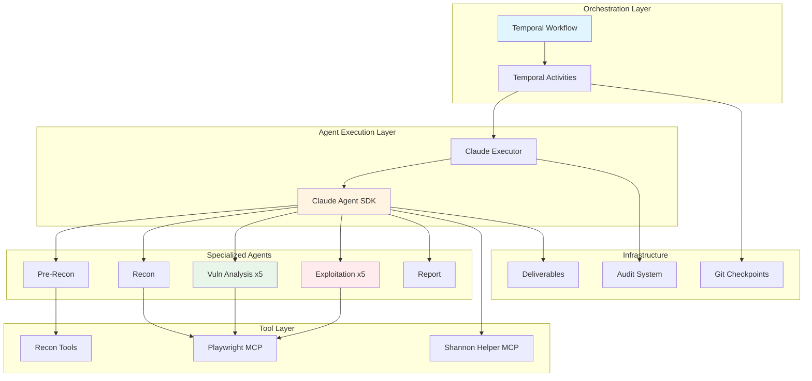

## Architectural Overview

Shannon is engineered to emulate the methodology of a human penetration tester through a sophisticated multi-agent architecture. Its strength lies in combining **white-box source code analysis** with **black-box dynamic exploitation**, orchestrated through durable workflows.

## System Architecture Diagram



## Hybrid Testing Approach

Shannon's power comes from combining two complementary testing methodologies:

<Tabs>
  <Tab title="White-Box Analysis">
    ### Source Code Analysis

    Shannon analyzes your application's source code to understand:

    - **Data Flow Paths**: How user input flows through the application
    - **Dangerous Sinks**: Where untrusted data reaches sensitive operations
    - **Security Controls**: Authentication, authorization, and input validation mechanisms
    - **Technology Stack**: Frameworks, libraries, and their known vulnerability patterns
    - **API Endpoints**: All exposed routes and their parameters

    **Key File**: `src/session-manager.ts:14-108` - Agent definitions and prerequisites

    ```typescript
    export const AGENTS: Readonly<Record<AgentName, AgentDefinition>> = {
      'pre-recon': {
        name: 'pre-recon',
        displayName: 'Pre-recon agent',
        prerequisites: [],
        promptTemplate: 'pre-recon-code',
        deliverableFilename: 'code_analysis_deliverable.md',
        modelTier: 'large',
      },
      // ... more agents
    };
    ```

  </Tab>
  <Tab title="Black-Box Exploitation">
    ### Live Application Testing

    Shannon validates findings against the running application:

    - **Browser Automation**: Playwright-based headless browser for realistic user interactions
    - **Authentication Handling**: Supports form login, SSO, 2FA/TOTP, and API authentication
    - **Real Exploits**: Executes actual injection attacks, XSS payloads, and auth bypass attempts
    - **Evidence Collection**: Screenshots, network logs, and response data
    - **Impact Validation**: Confirms that vulnerabilities can achieve real-world impact

    **Key File**: `src/session-manager.ts:152-181` - MCP agent mapping for parallel execution

    ```typescript
    export const MCP_AGENT_MAPPING: Record<string, PlaywrightAgent> = {
      // Phase 3: Vulnerability Analysis (5 parallel agents)
      'vuln-injection': 'playwright-agent1',
      'vuln-xss': 'playwright-agent2',
      'vuln-auth': 'playwright-agent3',
      'vuln-ssrf': 'playwright-agent4',
      'vuln-authz': 'playwright-agent5',
      // Phase 4: Exploitation (5 parallel agents)
      'exploit-injection': 'playwright-agent1',
      'exploit-xss': 'playwright-agent2',
      // ...
    };
    ```

  </Tab>
</Tabs>

## Core Modules

Shannon's codebase is organized into focused, testable modules:

### Agent Management

<CodeGroup>
```typescript src/session-manager.ts
// Agent definitions registry
export const AGENTS: Readonly<Record<AgentName, AgentDefinition>> = {
  // 13 total agents across 5 phases
};

// Phase mapping for metrics aggregation
export const AGENT_PHASE_MAP: Readonly<Record<AgentName, PhaseName>> = {
  'pre-recon': 'pre-recon',
  'recon': 'recon',
  'injection-vuln': 'vulnerability-analysis',
  'injection-exploit': 'exploitation',
  // ...
};
```

```typescript src/types/agents.ts
// Type-safe agent definitions
export const ALL_AGENTS = [
  'pre-recon',
  'recon',
  'injection-vuln',
  'xss-vuln',
  'auth-vuln',
  'ssrf-vuln',
  'authz-vuln',
  'injection-exploit',
  'xss-exploit',
  'auth-exploit',
  'ssrf-exploit',
  'authz-exploit',
  'report',
] as const;

export type AgentName = typeof ALL_AGENTS[number];
```
</CodeGroup>

### Temporal Orchestration

<AccordionGroup>
  <Accordion title="Workflow Orchestration" icon="diagram-project">
    **File**: `src/temporal/workflows.ts`

    The main workflow orchestrates all five phases:

    - Sequential execution for pre-recon and recon
    - Parallel execution for 5 vuln/exploit pipelines
    - Configurable concurrency limits (1-5 concurrent pipelines)
    - Graceful error handling - other pipelines continue if one fails
    - Queryable progress via `getProgress` query

    ```typescript
    export async function pentestPipelineWorkflow(
      input: PipelineInput
    ): Promise<PipelineState> {
      // Phase 1: Pre-Reconnaissance
      await runSequentialPhase('pre-recon', 'pre-recon', a.runPreReconAgent);
      
      // Phase 2: Reconnaissance
      await runSequentialPhase('recon', 'recon', a.runReconAgent);
      
      // Phases 3-4: Vulnerability + Exploitation (Pipelined)
      const pipelineResults = await runWithConcurrencyLimit(
        pipelineThunks,
        maxConcurrent
      );
      
      // Phase 5: Reporting
      await runSequentialPhase('reporting', 'report', a.runReportAgent);
    }
    ```
  </Accordion>

  <Accordion title="Activity Layer" icon="gears">
    **File**: `src/temporal/activities.ts`

    Activities are thin wrappers that:

    - Provide heartbeat for long-running operations
    - Classify errors as retryable vs. non-retryable
    - Manage container lifecycle
    - Delegate business logic to services

    ```typescript
    export async function runReconAgent(
      input: ActivityInput
    ): Promise<AgentMetrics> {
      return await executeAgent({
        agentName: 'recon',
        activityInput: input,
      });
    }
    ```
  </Accordion>

  <Accordion title="Service Layer" icon="layer-group">
    **Directory**: `src/services/`

    Business logic layer is Temporal-agnostic:

    - `agent-execution.ts` - Agent lifecycle management
    - `error-handling.ts` - Error classification and retry logic
    - `container.ts` - Dependency injection container
    - `prompt-manager.ts` - Prompt template loading and variable substitution
    - `queue-validation.ts` - Exploitation queue validation

    All services accept `ActivityLogger` interface and return `Result<T, E>` for explicit error handling.
  </Accordion>
</AccordionGroup>

### AI Execution Engine

**File**: `src/ai/claude-executor.ts`

The execution engine handles:

<Steps>
  <Step title="MCP Server Configuration">
    Configures Playwright and Shannon Helper MCP servers for each agent
  </Step>
  <Step title="SDK Invocation">
    Calls Claude Agent SDK with 10,000 max turns and bypass permissions mode
  </Step>
  <Step title="Message Streaming">
    Processes SDK message stream with progress updates and audit logging
  </Step>
  <Step title="Output Validation">
    Validates agent deliverables using agent-specific validators
  </Step>
  <Step title="Error Handling">
    Classifies errors and determines retry strategy
  </Step>
</Steps>

```typescript
export async function runClaudePrompt(
  prompt: string,
  sourceDir: string,
  context: string = '',
  description: string = 'Claude analysis',
  agentName: string | null = null,
  auditSession: AuditSession | null = null,
  logger: ActivityLogger,
  modelTier: ModelTier = 'medium'
): Promise<ClaudePromptResult> {
  const mcpServers = buildMcpServers(sourceDir, agentName, logger);
  
  for await (const message of query({ prompt: fullPrompt, options })) {
    // Process message stream
  }
  
  return { success: true, duration, turns, cost, model };
}
```

## Key Design Patterns

<CardGroup cols={2}>
  <Card title="Configuration-Driven" icon="file-code">
    YAML configs with JSON Schema validation for authentication, retry strategies, and testing parameters
  </Card>
  <Card title="Progressive Analysis" icon="stairs">
    Each phase builds on previous results - recon uses pre-recon data, exploits use vuln analysis
  </Card>
  <Card title="SDK-First" icon="brain">
    Claude Agent SDK handles autonomous analysis - Shannon provides orchestration and validation
  </Card>
  <Card title="Modular Error Handling" icon="triangle-exclamation">
    `Result<T,E>` pattern for explicit error propagation, automatic retry with exponential backoff
  </Card>
  <Card title="Services Boundary" icon="border-all">
    Activities are thin Temporal wrappers - services own business logic with no Temporal imports
  </Card>
  <Card title="DI Container" icon="box">
    Per-workflow dependency injection for testability and isolation
  </Card>
</CardGroup>

## Data Flow

Here's how data flows through Shannon during a pentest:

<Steps>
  <Step title="Input">
    User provides URL, repository path, and optional config via CLI
  </Step>
  <Step title="Pre-Recon">
    External tools (nmap, subfinder, whatweb) + source code analysis → `code_analysis_deliverable.md`
  </Step>
  <Step title="Recon">
    Attack surface mapping using pre-recon data → `recon_deliverable.md`
  </Step>
  <Step title="Vuln Analysis">
    5 parallel agents analyze for specific vuln types → `{vulntype}_analysis_deliverable.md` + exploitation queue
  </Step>
  <Step title="Exploitation">
    5 parallel agents exploit queued vulnerabilities → `{vulntype}_exploitation_evidence.md`
  </Step>
  <Step title="Reporting">
    Consolidate all evidence → `comprehensive_security_assessment_report.md`
  </Step>
</Steps>

## Supporting Systems

### Audit System

**Directory**: `src/audit/`

Crash-safe append-only logging:

- `audit-session.ts` - Session-level metrics and agent logs
- `workflow-logger.ts` - Human-readable workflow logs
- `log-stream.ts` - Shared stream primitive

Output structure:
```
audit-logs/{hostname}_{sessionId}/
├── session.json          # Metrics and session data
├── workflow.log          # Human-readable log
├── agents/               # Per-agent execution logs
├── prompts/              # Prompt snapshots
└── deliverables/
    └── comprehensive_security_assessment_report.md
```

### Prompt Management

**Directory**: `prompts/`

Prompt templates with variable substitution:

- Phase-specific prompts: `pre-recon-code.txt`, `vuln-injection.txt`, `exploit-auth.txt`
- Shared partials in `prompts/shared/`: `_target.txt`, `_rules.txt`, `login-instructions.txt`
- Variable substitution: `{{TARGET_URL}}`, `{{CONFIG_CONTEXT}}`, `{{LOGIN_INSTRUCTIONS}}`

### Deliverable Management

**Tool**: `save_deliverable` MCP tool

Agents save structured deliverables:

- Markdown format with consistent structure
- Git checkpointed after each agent completes
- Validated by agent-specific validators before marking complete
- Used as input for subsequent phases

## Next Steps

<CardGroup cols={2}>
  <Card title="Workflow Phases" icon="list-check" href="/concepts/workflow-phases">
    Deep dive into the five phases of execution
  </Card>
  <Card title="Agent System" icon="robot" href="/concepts/agent-system">
    Learn about agent definitions and parallel execution
  </Card>
  <Card title="Temporal Orchestration" icon="clock" href="/concepts/temporal-orchestration">
    Understand durable workflows and crash recovery
  </Card>
  <Card title="Core Modules" icon="code" href="/development/core-modules">
    Explore the codebase structure in detail
  </Card>
</CardGroup>
