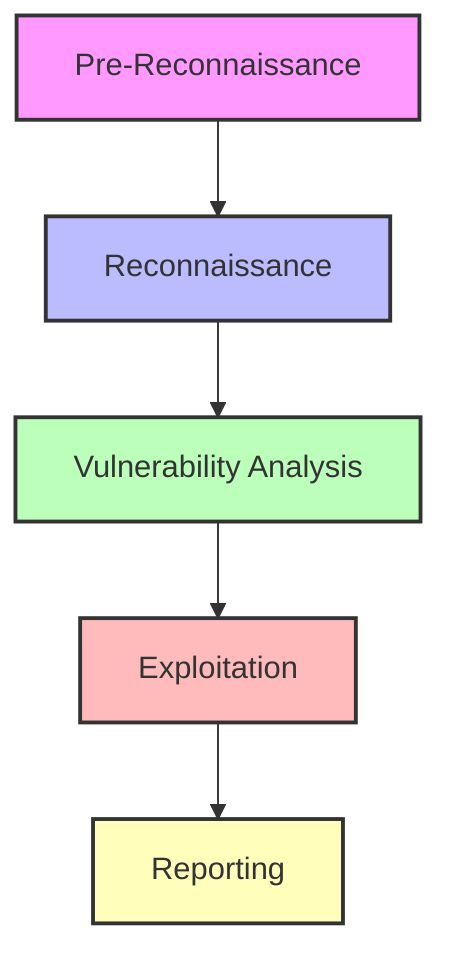

## Introduction

Shannon is a fully autonomous AI penetration tester that emulates human security researcher methodology through a sophisticated multi-agent architecture. Unlike traditional vulnerability scanners that simply flag potential issues, Shannon actively exploits vulnerabilities to prove they're real.

## The Shannon Methodology

Shannon follows a professional penetration tester's approach:

<Steps>
  <Step title="Reconnaissance">
    Map the application's attack surface through source code analysis and live exploration
  </Step>
  <Step title="Analysis">
    Identify potential vulnerabilities by tracing data flows and analyzing security controls
  </Step>
  <Step title="Exploitation">
    Execute real attacks to prove vulnerabilities are exploitable
  </Step>
  <Step title="Reporting">
    Document only verified findings with reproducible proof-of-concepts
  </Step>
</Steps>

## Key Design Principles

### White-Box + Black-Box Testing

Shannon uniquely combines two testing approaches:

- **White-Box Analysis**: Deep source code analysis to understand data flows and identify potential attack vectors
- **Black-Box Exploitation**: Live browser automation and command-line attacks to validate vulnerabilities in the running application

This hybrid approach enables Shannon to find complex vulnerabilities that pure static analysis tools miss, while maintaining the accuracy that comes from understanding the codebase.

### No Exploit, No Report

Shannon enforces a strict validation policy:

<Warning>
  If a hypothesized vulnerability cannot be successfully exploited to demonstrate real-world impact, it is discarded as a false positive.
</Warning>

This approach dramatically reduces false positives compared to traditional scanners that report anything that "might" be vulnerable.

### Parallel Multi-Agent Execution

To maximize efficiency, Shannon runs multiple specialized agents in parallel:

- 5 vulnerability analysis agents run concurrently (injection, XSS, auth, authz, SSRF)
- 5 exploitation agents run in parallel after their respective analysis completes
- Each agent is specialized for a specific vulnerability class

## Architecture Layers

Shannon's architecture consists of four main layers:

<CardGroup cols={2}>
  <Card title="Orchestration Layer" icon="diagram-project">
    Temporal workflows manage durable execution, crash recovery, and progress tracking
  </Card>
  <Card title="Agent Layer" icon="brain">
    Specialized AI agents powered by Claude for each security testing phase
  </Card>
  <Card title="Tool Layer" icon="toolbox">
    Browser automation, reconnaissance tools (nmap, subfinder), and MCP servers
  </Card>
  <Card title="Audit Layer" icon="file-lines">
    Crash-safe logging, metrics tracking, and deliverable management
  </Card>
</CardGroup>

## Five-Phase Pipeline

Every Shannon pentest follows a consistent five-phase workflow:

See [Workflow Phases](/concepts/workflow-phases) for detailed information about each phase.

## Core Technologies

<CardGroup cols={2}>
  <Card title="Anthropic Claude" icon="brain">
    Powers autonomous reasoning and security analysis through the Claude Agent SDK
  </Card>
  <Card title="Temporal" icon="clock">
    Provides durable workflow orchestration with crash recovery and resume capabilities
  </Card>
  <Card title="Playwright" icon="window-maximize">
    Enables headless browser automation for live exploitation
  </Card>
  <Card title="MCP Protocol" icon="plug">
    Model Context Protocol servers provide tool access to AI agents
  </Card>
</CardGroup>

## What Makes Shannon Different

### Traditional Scanners

- Report thousands of potential issues
- High false positive rates
- No proof of exploitability
- Require manual verification
- Static analysis only

### Shannon

- Reports only verified, exploitable vulnerabilities
- Minimal false positives
- Provides working proof-of-concept exploits
- Fully autonomous validation
- Combines static analysis with dynamic exploitation

## Next Steps

<CardGroup cols={2}>
  <Card title="Architecture" icon="sitemap" href="/concepts/architecture">
    Explore Shannon's multi-agent architecture and design
  </Card>
  <Card title="Workflow Phases" icon="list-check" href="/concepts/workflow-phases">
    Learn about the five phases of Shannon's pentest pipeline
  </Card>
  <Card title="Agent System" icon="robot" href="/concepts/agent-system">
    Understand how specialized agents work together
  </Card>
  <Card title="Temporal Orchestration" icon="gears" href="/concepts/temporal-orchestration">
    Discover how durable workflows enable crash recovery
  </Card>
</CardGroup>
