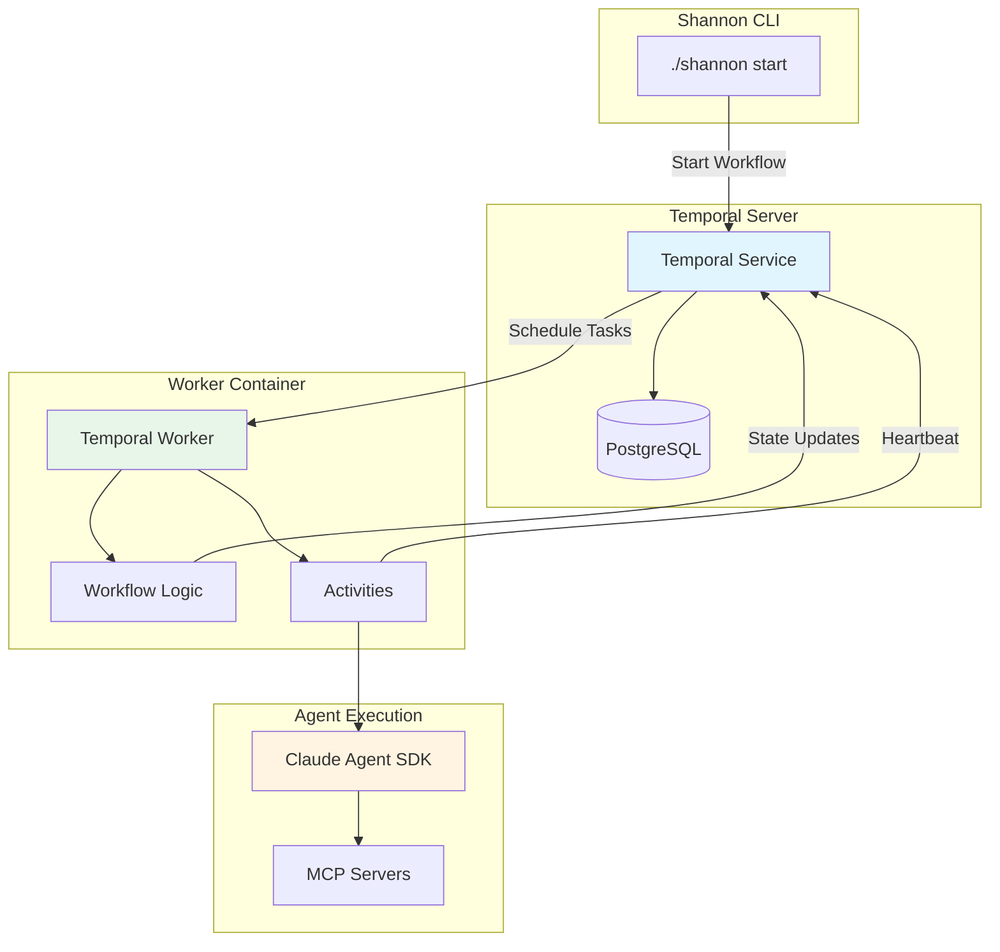
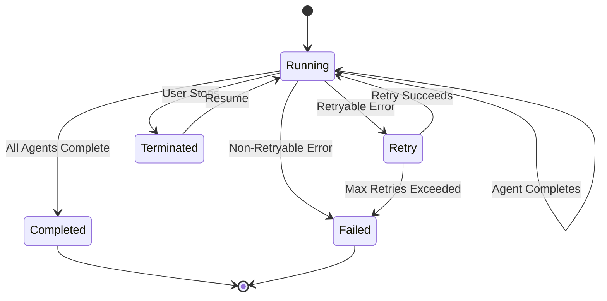
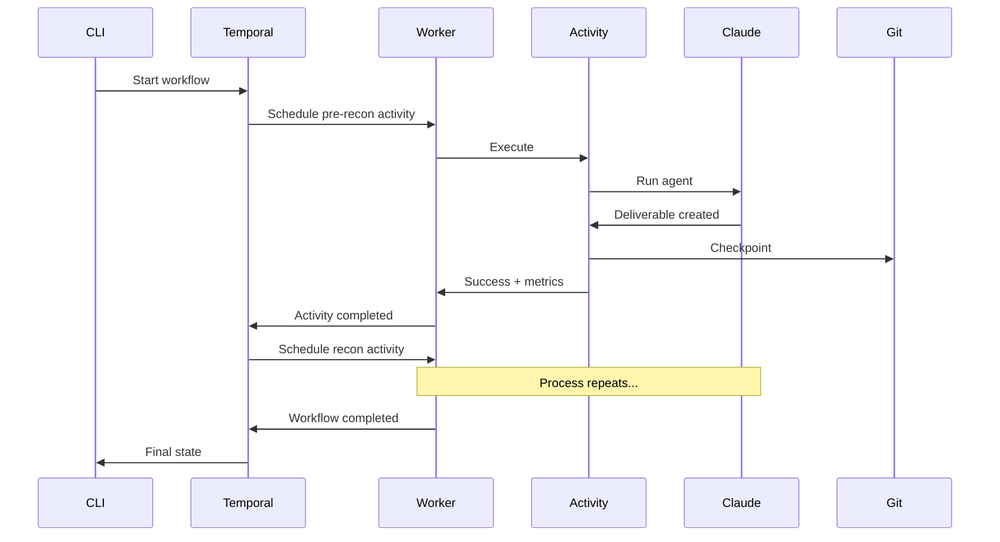

## Overview

Shannon uses [Temporal](https://temporal.io) for workflow orchestration, providing production-grade durability, crash recovery, and observability. Temporal ensures that even if Shannon crashes or is interrupted, the pentest can resume from where it left off without re-running completed agents.

## Why Temporal?

Penetration tests can run for 1-2 hours and cost $30-50 in API fees. Traditional orchestration approaches would force you to start over from scratch if anything goes wrong. Temporal solves this through:

<CardGroup cols={2}>
  <Card title="Durable Execution" icon="shield-check">
    Workflow state is persisted to a database. If the worker crashes, it can resume from the last checkpoint.
  </Card>
  <Card title="Automatic Retries" icon="arrows-rotate">
    Transient errors (rate limits, network issues) are automatically retried with exponential backoff.
  </Card>
  <Card title="Queryable State" icon="magnifying-glass">
    Check workflow progress in real-time without waiting for completion.
  </Card>
  <Card title="Event History" icon="clock-rotate-left">
    Complete audit trail of every step taken, enabling debugging and compliance.
  </Card>
</CardGroup>

## Architecture



## Core Concepts

### Workflows

Workflows contain the orchestration logic - what order to run agents, how to handle failures, when to run in parallel.

**File**: `src/temporal/workflows.ts`

```typescript
export async function pentestPipelineWorkflow(
  input: PipelineInput
): Promise<PipelineState> {
  const state: PipelineState = {
    status: 'running',
    currentPhase: null,
    currentAgent: null,
    completedAgents: [],
    failedAgent: null,
    error: null,
    startTime: Date.now(),
    agentMetrics: {},
    summary: null,
  };
  
  // Enable progress queries
  setHandler(getProgress, (): PipelineProgress => ({
    ...state,
    workflowId,
    elapsedMs: Date.now() - state.startTime,
  }));
  
  // Execute phases
  await runSequentialPhase('pre-recon', 'pre-recon', a.runPreReconAgent);
  await runSequentialPhase('recon', 'recon', a.runReconAgent);
  
  const pipelineResults = await runWithConcurrencyLimit(pipelineThunks, maxConcurrent);
  
  await runSequentialPhase('reporting', 'report', a.runReportAgent);
  
  state.status = 'completed';
  return state;
}
```

<Note>
  Workflows must be **deterministic** - they can't make random choices or call external APIs directly. That's why actual work happens in Activities.
</Note>

### Activities

Activities perform non-deterministic work like API calls, file I/O, or running agents. They can fail and be retried.

**File**: `src/temporal/activities.ts`

```typescript
export async function runReconAgent(
  input: ActivityInput
): Promise<AgentMetrics> {
  // Delegate to service layer
  return await executeAgent({
    agentName: 'recon',
    activityInput: input,
  });
}

export async function runInjectionVulnAgent(
  input: ActivityInput  
): Promise<AgentMetrics> {
  return await executeAgent({
    agentName: 'injection-vuln',
    activityInput: input,
  });
}
```

Activities are thin wrappers that:
- Provide heartbeat signals ("I'm still alive")
- Classify errors as retryable vs non-retryable
- Delegate actual work to services

### Queries

Queries allow you to inspect workflow state without waiting for completion:

```typescript
// Define query in workflow
setHandler(getProgress, (): PipelineProgress => ({
  ...state,
  workflowId,
  elapsedMs: Date.now() - state.startTime,
}));
```

```bash
# Query from CLI
./shannon query ID=shannon-1234567890
```

**Output**:
```json
{
  "status": "running",
  "currentPhase": "vulnerability-exploitation",
  "currentAgent": "pipelines",
  "completedAgents": ["pre-recon", "recon"],
  "elapsedMs": 1847293,
  "agentMetrics": {
    "pre-recon": { "costUsd": 2.45, "durationMs": 892341 },
    "recon": { "costUsd": 1.87, "durationMs": 954952 }
  }
}
```

## Retry Strategies

Shannon implements intelligent retry logic with three presets:

<Tabs>
  <Tab title="Production (Default)">
    Optimized for production API usage with generous retry windows:

    ```typescript
    const PRODUCTION_RETRY = {
      initialInterval: '5 minutes',
      maximumInterval: '30 minutes',
      backoffCoefficient: 2,
      maximumAttempts: 50,
      nonRetryableErrorTypes: [
        'AuthenticationError',
        'PermissionError',
        'InvalidRequestError',
        'RequestTooLargeError',
        'ConfigurationError',
        'InvalidTargetError',
        'ExecutionLimitError',
      ],
    };
    ```

    **Timeline**:
    - Attempt 1: Immediate
    - Attempt 2: +5 minutes
    - Attempt 3: +10 minutes
    - Attempt 4: +20 minutes
    - Attempt 5: +30 minutes
    - ... up to 50 attempts

    Use for: Normal pentests
  </Tab>

  <Tab title="Subscription">
    Extended retry for Anthropic subscription plans with 5-hour rolling rate limits:

    ```typescript
    const SUBSCRIPTION_RETRY = {
      initialInterval: '5 minutes',
      maximumInterval: '6 hours',
      backoffCoefficient: 2,
      maximumAttempts: 100,
      nonRetryableErrorTypes: PRODUCTION_RETRY.nonRetryableErrorTypes,
    };
    ```

    Enable in config:
    ```yaml
    pipeline:
      retry_preset: subscription
    ```

    Use for: Anthropic subscription plans (not pay-as-you-go)
  </Tab>

  <Tab title="Testing">
    Fast retries for development:

    ```typescript
    const TESTING_RETRY = {
      initialInterval: '10 seconds',
      maximumInterval: '30 seconds',
      backoffCoefficient: 2,
      maximumAttempts: 5,
      nonRetryableErrorTypes: PRODUCTION_RETRY.nonRetryableErrorTypes,
    };
    ```

    Enable with:
    ```bash
    ./shannon start URL=... REPO=... PIPELINE_TESTING=true
    ```

    Use for: Development and testing
  </Tab>
</Tabs>

### Non-Retryable Errors

Some errors should never be retried because they're permanent:

- **AuthenticationError**: Invalid API key
- **PermissionError**: Insufficient permissions
- **InvalidRequestError**: Malformed request
- **RequestTooLargeError**: Prompt exceeds model limits
- **ConfigurationError**: Invalid config file
- **InvalidTargetError**: Target URL unreachable
- **ExecutionLimitError**: Hit model context window limit

These cause immediate workflow failure.

## Crash Recovery

Temporal's durable execution means Shannon can recover from crashes:

### Scenario 1: Worker Crash

If the worker container crashes mid-pentest:

<Steps>
  <Step title="Crash Detected">
    Temporal Server notices worker heartbeat stopped
  </Step>
  <Step title="Activity Timeout">
    After heartbeat timeout (60 minutes), activity is marked as failed
  </Step>
  <Step title="Retry Scheduled">
    Temporal schedules retry according to retry policy (5 min initial interval)
  </Step>
  <Step title="Worker Restarts">
    When worker comes back online, it picks up the scheduled retry
  </Step>
  <Step title="Resume Execution">
    Activity restarts from the beginning, but completed agents are already checkpointed
  </Step>
</Steps>

### Scenario 2: Network Interruption

If network connection to Anthropic API is lost:

1. Activity throws retryable error
2. Temporal automatically retries with exponential backoff
3. When network recovers, activity completes successfully

### Scenario 3: API Rate Limit

If you hit Anthropic rate limits:

1. Error classified as `BillingError` (retryable)
2. Temporal backs off for 5-30 minutes (production) or 5-6 hours (subscription)
3. Once rate limit resets, activity resumes

## Workspace Resume

Shannon extends Temporal's crash recovery with **workspace resume**, allowing you to manually resume interrupted pentests:

### How It Works

<Steps>
  <Step title="Git Checkpoints">
    After each agent completes, Shannon commits deliverables to git:
    
    ```bash
    git add deliverables/recon_deliverable.md
    git commit -m "Agent: recon - completed successfully"
    ```
  </Step>

  <Step title="Session Metadata">
    Completed agents tracked in `audit-logs/{workspace}/session.json`:
    
    ```json
    {
      "sessionId": "example-com_shannon-1234",
      "workflowId": "shannon-1234567890",
      "completedAgents": ["pre-recon", "recon"],
      "checkpointHash": "a1b2c3d4e5f6"
    }
    ```
  </Step>

  <Step title="Resume Command">
    To resume an interrupted run:
    
    ```bash
    ./shannon start URL=https://app.example.com REPO=my-repo \
      WORKSPACE=example-com_shannon-1234
    ```
  </Step>

  <Step title="State Restoration">
    Shannon:
    - Loads session.json to see which agents completed
    - Restores git workspace to checkpoint
    - Cleans up any incomplete deliverables
    - Starts new workflow, skipping completed agents
  </Step>

  <Step title="Continue Execution">
    Pentest continues from where it left off:
    
    ```typescript
    const shouldSkip = (agentName: string): boolean => {
      return resumeState?.completedAgents.includes(agentName) ?? false;
    };
    
    if (!shouldSkip('injection-vuln')) {
      state.agentMetrics['injection-vuln'] = await a.runInjectionVulnAgent(...);
    } else {
      log.info('Skipping injection-vuln (already complete)');
    }
    ```
  </Step>
</Steps>

### Resume Example

```bash
# Start a pentest
./shannon start URL=https://example.com REPO=my-app WORKSPACE=audit-q1
# -> Workflow ID: shannon-1234567890
# -> Runs pre-recon, recon, starts vuln analysis...
# -> Interrupted! (Ctrl+C, crash, etc.)

# List workspaces to find the ID
./shannon workspaces
# Output:
# example-com_audit-q1 (2 of 13 agents complete)

# Resume from where it left off
./shannon start URL=https://example.com REPO=my-app WORKSPACE=audit-q1
# -> Skips pre-recon and recon
# -> Continues with vuln analysis
```

<Warning>
  The `URL` parameter must match the original workspace URL. Shannon rejects mismatched URLs to prevent cross-target contamination.
</Warning>

## Observability

Temporal provides multiple ways to monitor Shannon:

### Temporal Web UI

Access at `http://localhost:8233`:

<Frame>
  
</Frame>

**Features**:
- Real-time workflow status
- Event history (complete audit trail)
- Stack traces for failures
- Query execution
- Workflow search and filtering

### CLI Tools

```bash
# View real-time logs
./shannon logs

# Query specific workflow
./shannon query ID=shannon-1234567890

# List all workspaces
./shannon workspaces
```

### Audit Logs

Shannon maintains its own audit logs in `audit-logs/{workspace}/`:

```
audit-logs/example-com_shannon-1234/
├── session.json              # Session metadata and metrics
├── workflow.log              # Human-readable workflow log
├── agents/
│   ├── pre-recon.log        # Per-agent execution logs
│   ├── recon.log
│   └── injection-vuln.log
├── prompts/
│   ├── pre-recon.txt        # Prompt snapshots for reproducibility
│   └── recon.txt
└── deliverables/
    ├── code_analysis_deliverable.md
    └── recon_deliverable.md
```

## Workflow State Machine



**State Definitions**:

- **Running**: Workflow actively executing agents
- **Retry**: Activity failed with retryable error, waiting for retry interval
- **Completed**: All 13 agents completed successfully
- **Failed**: Encountered non-retryable error or exceeded max retries
- **Terminated**: User stopped workflow (Ctrl+C or `./shannon stop`)

## Temporal Client

The CLI interacts with Temporal through the client:

**File**: `src/temporal/client.ts`

```typescript
import { Connection, Client } from '@temporalio/client';

export async function startPentestWorkflow(
  input: PipelineInput
): Promise<string> {
  const connection = await Connection.connect({
    address: 'localhost:7233',
  });
  
  const client = new Client({ connection });
  
  const workflowId = `shannon-${Date.now()}`;
  
  const handle = await client.workflow.start(pentestPipelineWorkflow, {
    taskQueue: 'shannon-pentest',
    workflowId,
    args: [input],
  });
  
  return workflowId;
}
```

## Worker Configuration

The worker polls for tasks and executes them:

**File**: `src/temporal/worker.ts`

```typescript
import { Worker } from '@temporalio/worker';
import * as activities from './activities.js';

async function run() {
  const worker = await Worker.create({
    workflowsPath: require.resolve('./workflows'),
    activities,
    taskQueue: 'shannon-pentest',
  });
  
  await worker.run();
}

run().catch((err) => {
  console.error(err);
  process.exit(1);
});
```

## Data Flow



## Best Practices

<AccordionGroup>
  <Accordion title="Use Named Workspaces" icon="tag">
    Named workspaces make resume easier:
    
    ```bash
    # Good
    ./shannon start URL=... REPO=... WORKSPACE=q1-audit
    
    # Harder to remember
    ./shannon start URL=... REPO=...
    # -> Auto-named: example-com_shannon-1771007534808
    ```
  </Accordion>

  <Accordion title="Monitor Progress" icon="chart-line">
    Check progress periodically instead of waiting for completion:
    
    ```bash
    # Terminal 1: Start pentest
    ./shannon start URL=... REPO=... WORKSPACE=my-audit
    
    # Terminal 2: Monitor logs
    ./shannon logs
    
    # Terminal 3: Query progress
    watch -n 30 './shannon query ID=shannon-1234567890'
    ```
  </Accordion>

  <Accordion title="Configure Retry Presets" icon="gears">
    Match retry strategy to your Anthropic plan:
    
    **Pay-as-you-go**: Default (production) preset is fine
    
    **Subscription plan**: Use subscription preset
    ```yaml
    pipeline:
      retry_preset: subscription
    ```
  </Accordion>

  <Accordion title="Clean Up Old Workspaces" icon="trash">
    Workspaces accumulate over time:
    
    ```bash
    # List workspaces
    ./shannon workspaces
    
    # Clean up old ones
    rm -rf audit-logs/old-workspace-name
    ```
  </Accordion>
</AccordionGroup>

## Troubleshooting

<AccordionGroup>
  <Accordion title="Workflow Not Starting" icon="circle-exclamation">
    **Symptoms**: `./shannon start` hangs or fails
    
    **Solutions**:
    1. Check if Temporal is running: `docker compose ps`
    2. Check Temporal health: `curl http://localhost:8233`
    3. View Temporal logs: `docker compose logs temporal`
    4. Restart Temporal: `./shannon stop && ./shannon start ...`
  </Accordion>

  <Accordion title="Worker Not Picking Up Tasks" icon="pause">
    **Symptoms**: Workflow shows as "Running" but no progress
    
    **Solutions**:
    1. Check worker logs: `./shannon logs`
    2. Check worker status: `docker compose ps worker`
    3. Restart worker: `docker compose restart worker`
  </Accordion>

  <Accordion title="Resume Not Working" icon="rotate-right">
    **Symptoms**: Resume starts agents from beginning
    
    **Solutions**:
    1. Verify workspace name: `./shannon workspaces`
    2. Check session.json exists: `cat audit-logs/{workspace}/session.json`
    3. Verify URL matches: Compare URL in session.json with resume command
    4. Check git repository is clean: `git status` in target repo
  </Accordion>

  <Accordion title="Activity Timeout" icon="clock">
    **Symptoms**: Activity fails with "heartbeat timeout"
    
    **Cause**: Agent took longer than 60 minutes without sending heartbeat
    
    **Solutions**:
    1. Check if agent is actually stuck (logs)
    2. Increase heartbeat timeout in workflow config (not recommended)
    3. Resume workflow - it will retry the agent
  </Accordion>
</AccordionGroup>

## Next Steps

<CardGroup cols={2}>
  <Card title="Workspaces & Resume" icon="floppy-disk" href="/advanced/workspaces-resume">
    Complete guide to workspace management and resume
  </Card>
  <Card title="Configuration" icon="sliders" href="/configuration/retry-strategies">
    Configure retry strategies for your Anthropic plan
  </Card>
  <Card title="Troubleshooting" icon="wrench" href="/guides/troubleshooting">
    Common issues and solutions
  </Card>
  <Card title="Architecture" icon="sitemap" href="/concepts/architecture">
    Understand Shannon's overall architecture
  </Card>
</CardGroup>
