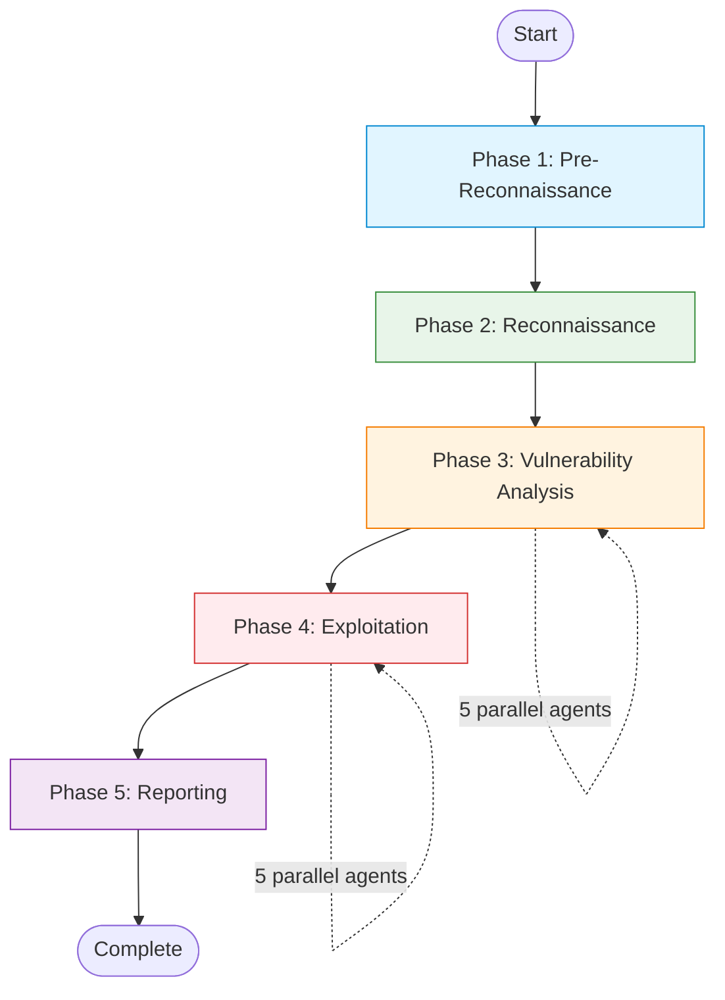

## Overview

Every Shannon pentest follows a consistent five-phase workflow designed to mirror how a professional penetration tester approaches security assessment. Each phase builds on the previous phase's deliverables, creating a progressive analysis pipeline.

## Phase Diagram



## Phase 1: Pre-Reconnaissance

**Agent**: `pre-recon`  
**Model Tier**: Large (Claude Opus)  
**Deliverable**: `code_analysis_deliverable.md`

### Purpose

Build a comprehensive technical foundation by analyzing the application's source code and running external reconnaissance tools.

### Activities

<Tabs>
  <Tab title="Source Code Analysis">
    The pre-recon agent performs deep static analysis:

    - **Technology Stack Detection**: Identifies frameworks, libraries, languages, and build tools
    - **Architecture Mapping**: Understands application structure, entry points, and data flow
    - **Endpoint Discovery**: Catalogs all API routes, controllers, and handlers
    - **Security Control Analysis**: Identifies authentication, authorization, and validation mechanisms
    - **Dependency Analysis**: Examines third-party libraries for known vulnerabilities
    - **Configuration Review**: Analyzes environment variables, config files, and security settings

    ```typescript
    // Example agent configuration from src/session-manager.ts:15-22
    'pre-recon': {
      name: 'pre-recon',
      displayName: 'Pre-recon agent',
      prerequisites: [],
      promptTemplate: 'pre-recon-code',
      deliverableFilename: 'code_analysis_deliverable.md',
      modelTier: 'large',
    }
    ```
  </Tab>

  <Tab title="External Reconnaissance">
    Integrated security tools provide infrastructure intelligence:

    **Nmap** - Network port scanning
    - Open ports and services
    - Service version detection
    - OS fingerprinting

    **Subfinder** - Subdomain enumeration
    - DNS subdomain discovery
    - Additional attack surface identification

    **WhatWeb** - Web technology fingerprinting
    - Server software detection
    - CMS and framework identification
    - Security header analysis

    <Note>
      External tools run with graceful degradation. If they're unavailable (e.g., in `PIPELINE_TESTING=true` mode), Shannon continues with source code analysis only.
    </Note>
  </Tab>

  <Tab title="Output Format">
    The deliverable provides structured intelligence:

    ```markdown
    # Code Analysis Deliverable

    ## Technology Stack
    - **Backend**: Node.js + Express
    - **Frontend**: React
    - **Database**: PostgreSQL
    - **Authentication**: JWT tokens

    ## Attack Surface
    - 47 API endpoints identified
    - 12 require authentication
    - 3 admin-only endpoints

    ## Security Controls
    - Input validation: Partial (client-side only on 8 endpoints)
    - SQL queries: Mixed (parameterized + string concatenation)
    - CSRF protection: Not implemented

    ## High-Priority Areas
    1. User input handlers in /api/search
    2. Admin panel authentication in /api/admin/*
    3. File upload functionality in /api/upload
    ```
  </Tab>
</Tabs>

### Duration

Typically **10-15 minutes** depending on codebase size and complexity.

---

## Phase 2: Reconnaissance

**Agent**: `recon`  
**Prerequisites**: `pre-recon`  
**Deliverable**: `recon_deliverable.md`

### Purpose

Perform live application exploration using the pre-recon intelligence as a guide. Map the actual attack surface by interacting with the running application.

### Activities

<AccordionGroup>
  <Accordion title="Browser Automation" icon="window-maximize">
    Using Playwright MCP, the recon agent:

    - Navigates the application like a real user
    - Tests authentication flows (login, registration, password reset)
    - Maps all accessible pages and forms
    - Identifies client-side validation logic
    - Captures screenshots for documentation
    - Records network requests and responses
  </Accordion>

  <Accordion title="Endpoint Validation" icon="link">
    Validates findings from source code analysis:

    - Confirms which API endpoints are actually exposed
    - Tests endpoint authentication requirements
    - Identifies undocumented endpoints
    - Maps parameter requirements
    - Tests rate limiting and access controls
  </Accordion>

  <Accordion title="Authentication Testing" icon="shield-halved">
    If authentication config is provided:

    - Executes login flow (form, SSO, API, basic auth)
    - Handles 2FA/TOTP if configured
    - Tests session management
    - Identifies privilege levels (user, admin, etc.)
    - Maps authenticated vs. unauthenticated access

    **Config Example**:
    ```yaml
    authentication:
      login_type: form
      login_url: "https://app.example.com/login"
      credentials:
        username: "test@example.com"
        password: "P@ssw0rd123"
        totp_secret: "LB2E2RX7XFHSTGCK"
      login_flow:
        - "Type $username into the email field"
        - "Type $password into the password field"
        - "Click the 'Sign In' button"
    ```
  </Accordion>

  <Accordion title="Attack Surface Mapping" icon="map">
    Creates a comprehensive attack surface map:

    - All discovered endpoints with HTTP methods
    - Form inputs and their validation
    - File upload endpoints
    - API parameter structures
    - Cookies, headers, and tokens
    - Error messages and stack traces
  </Accordion>
</AccordionGroup>

### Duration

Typically **15-20 minutes** depending on application complexity and authentication requirements.

---

## Phase 3: Vulnerability Analysis

**Agents**: 5 parallel specialized agents  
**Prerequisites**: `recon`  
**Deliverables**: 5 analysis files + exploitation queues

### Purpose

Identify potential vulnerabilities through structured analysis. Each agent specializes in a specific OWASP vulnerability class.

### Parallel Execution

<Note>
  All 5 vulnerability analysis agents run **concurrently in parallel** to maximize speed. Each has its own isolated Playwright browser instance to prevent conflicts.
</Note>

```typescript
// From src/temporal/workflows.ts:380-387
state.currentPhase = 'vulnerability-exploitation';
state.currentAgent = 'pipelines';
await a.logPhaseTransition(activityInput, 'vulnerability-exploitation', 'start');

const maxConcurrent = input.pipelineConfig?.max_concurrent_pipelines ?? 5;
const pipelineResults = await runWithConcurrencyLimit(pipelineThunks, maxConcurrent);
```

### Vulnerability Agents

<Tabs>
  <Tab title="Injection (injection-vuln)">
    **Focus**: SQL Injection, Command Injection, NoSQL Injection

    **Analysis Method**:
    - Data flow analysis from user inputs to database queries
    - Command execution sink identification
    - ORM/query builder usage analysis
    - Input sanitization effectiveness

    **Deliverable**: `injection_analysis_deliverable.md`

    **Exploitation Queue**: JSON file with:
    ```json
    {
      "vulnerabilities": [
        {
          "id": "INJ-001",
          "type": "SQL Injection",
          "endpoint": "/api/search",
          "parameter": "query",
          "description": "User input concatenated directly into SQL query",
          "code_location": "src/api/search.js:45",
          "payload_suggestion": "' OR '1'='1",
          "confidence": "high"
        }
      ]
    }
    ```
  </Tab>

  <Tab title="XSS (xss-vuln)">
    **Focus**: Stored XSS, Reflected XSS, DOM-based XSS

    **Analysis Method**:
    - User input to DOM rendering path analysis
    - Template engine safety review
    - Content-Security-Policy analysis
    - Client-side JavaScript vulnerability scanning

    **Deliverable**: `xss_analysis_deliverable.md`

    **Key Checks**:
    - Unescaped user input in templates
    - `innerHTML`, `eval()`, `dangerouslySetInnerHTML` usage
    - URL parameters reflected in pages
    - Rich text editor implementations
  </Tab>

  <Tab title="Auth (auth-vuln)">
    **Focus**: Broken Authentication

    **Analysis Method**:
    - Authentication mechanism review
    - Session management analysis
    - JWT token security (algorithm, secret, expiration)
    - Password reset flow testing
    - Multi-factor authentication bypass

    **Deliverable**: `auth_analysis_deliverable.md`

    **Attack Vectors**:
    - JWT algorithm confusion (RS256 → HS256)
    - JWT `alg: none` bypass
    - Weak secret keys
    - Session fixation
    - Predictable tokens
  </Tab>

  <Tab title="Authz (authz-vuln)">
    **Focus**: Broken Authorization, IDOR

    **Analysis Method**:
    - Access control enforcement points
    - Object-level authorization checks
    - Role-based access control (RBAC) implementation
    - Horizontal and vertical privilege escalation

    **Deliverable**: `authz_analysis_deliverable.md`

    **Common Issues**:
    - Missing authorization checks
    - Client-side only authorization
    - Insecure Direct Object References (IDOR)
    - Function-level access control missing
  </Tab>

  <Tab title="SSRF (ssrf-vuln)">
    **Focus**: Server-Side Request Forgery

    **Analysis Method**:
    - URL parameter to HTTP request tracing
    - Internal network access patterns
    - DNS rebinding vulnerability potential
    - Cloud metadata endpoint accessibility

    **Deliverable**: `ssrf_analysis_deliverable.md`

    **Attack Scenarios**:
    - Internal port scanning
    - Cloud metadata service access (169.254.169.254)
    - Internal service exploitation
    - File system access via file:// protocol
  </Tab>
</Tabs>

### Concurrency Control

You can limit parallel execution to reduce API usage bursts:

```yaml
# In config YAML
pipeline:
  max_concurrent_pipelines: 2  # Run 2 of 5 pipelines at a time
```

### Duration

Typically **30-45 minutes total** with all 5 agents running in parallel.

---

## Phase 4: Exploitation

**Agents**: 5 conditional parallel agents  
**Prerequisites**: Corresponding vuln analysis agent  
**Deliverables**: 5 exploitation evidence files (if vulnerabilities found)

### Purpose

Execute real-world attacks to **prove** that hypothesized vulnerabilities are actually exploitable. Only findings that can be successfully exploited are reported.

### Conditional Execution

<Warning>
  Exploitation agents only run if their corresponding vulnerability analysis found actionable issues.
</Warning>

```typescript
// From src/temporal/workflows.ts:389-416
async function runVulnExploitPipeline(
  vulnType: VulnType,
  runVulnAgent: () => Promise<AgentMetrics>,
  runExploitAgent: () => Promise<AgentMetrics>
): Promise<VulnExploitPipelineResult> {
  // 1. Run vulnerability analysis
  let vulnMetrics = await runVulnAgent();
  
  // 2. Check exploitation queue for actionable findings
  const decision = await a.checkExploitationQueue(activityInput, vulnType);
  
  // 3. Conditionally run exploitation agent
  let exploitMetrics: AgentMetrics | null = null;
  if (decision.shouldExploit) {
    exploitMetrics = await runExploitAgent();
  }
  
  return { vulnType, vulnMetrics, exploitMetrics };
}
```

### Exploitation Agents

<Tabs>
  <Tab title="Injection Exploitation">
    **Agent**: `injection-exploit`

    **Exploitation Techniques**:
    - SQL Injection with UNION queries
    - Blind SQL injection (time-based, boolean-based)
    - Command injection with shell metacharacters
    - NoSQL injection operators

    **Evidence Collection**:
    - Database content extraction
    - Command execution output
    - Error messages revealing database structure
    - Screenshots of successful exploits

    **Example Evidence**:
    
    Successful SQL injection proof-of-concept extracting all usernames and password hashes from the database via UNION SELECT attack on POST /api/search endpoint.
  </Tab>

  <Tab title="XSS Exploitation">
    **Agent**: `xss-exploit`

    **Exploitation Techniques**:
    - Stored XSS payload injection
    - Reflected XSS with crafted URLs
    - DOM-based XSS with JavaScript payloads
    - CSP bypass techniques

    **Evidence Collection**:
    - Alert box / console output screenshots
    - Cookie theft proof-of-concept
    - Session hijacking demonstration
    - Keylogger injection
  </Tab>

  <Tab title="Auth Exploitation">
    **Agent**: `auth-exploit`

    **Exploitation Techniques**:
    - JWT algorithm confusion attack
    - JWT signature bypass (alg: none)
    - Session token prediction
    - Password reset token manipulation
    - Brute force with common credentials

    **Evidence Collection**:
    - Forged JWT tokens
    - Unauthorized access screenshots
    - Admin panel access proof
    - Privilege escalation demonstration
  </Tab>

  <Tab title="Authz Exploitation">
    **Agent**: `authz-exploit`

    **Exploitation Techniques**:
    - IDOR parameter manipulation
    - Horizontal privilege escalation (access other users' data)
    - Vertical privilege escalation (user → admin)
    - Direct API endpoint access bypassing UI

    **Evidence Collection**:
    - Other users' data accessed
    - Admin functions executed as regular user
    - Mass data enumeration
  </Tab>

  <Tab title="SSRF Exploitation">
    **Agent**: `ssrf-exploit`

    **Exploitation Techniques**:
    - Internal port scanning
    - Cloud metadata service access
    - Internal service enumeration
    - File system access attempts

    **Evidence Collection**:
    - Internal network responses
    - Cloud metadata retrieved (IAM credentials, etc.)
    - Internal service banners
    - Unauthorized data access
  </Tab>
</Tabs>

### No Exploit, No Report

<Info>
  If an exploitation agent cannot successfully prove a vulnerability through actual exploitation, that finding is **discarded** as a false positive. Only proven exploits make it to the final report.
</Info>

### Duration

Typically **30-60 minutes total** with all 5 agents running in parallel (only for vulnerability types with findings).

---

## Phase 5: Reporting

**Agent**: `report`  
**Model Tier**: Small (Claude Haiku)  
**Prerequisites**: All 5 exploit agents  
**Deliverable**: `comprehensive_security_assessment_report.md`

### Purpose

Consolidate all validated findings into a professional, actionable penetration test report.

### Report Generation Process

<Steps>
  <Step title="Evidence Assembly">
    Concatenate all exploitation evidence files into a single document:
    - `injection_exploitation_evidence.md`
    - `xss_exploitation_evidence.md`
    - `auth_exploitation_evidence.md`
    - `authz_exploitation_evidence.md`
    - `ssrf_exploitation_evidence.md`
  </Step>

  <Step title="Report Generation">
    The report agent:
    - Adds executive summary
    - Categorizes findings by severity (Critical, High, Medium, Low)
    - Removes hallucinated or unverified content
    - Formats for readability
    - Adds remediation recommendations
  </Step>

  <Step title="Metadata Injection">
    Final report includes:
    - Model information (which Claude model was used)
    - Timestamp and duration
    - Configuration used
    - Target application details
  </Step>
</Steps>

### Report Structure

```markdown
# Comprehensive Security Assessment Report

## Executive Summary

**Target Application**: https://app.example.com  
**Assessment Date**: 2025-03-05  
**Total Vulnerabilities Found**: 12  
- Critical: 3
- High: 5
- Medium: 3
- Low: 1

## Critical Findings

### 1. SQL Injection in Search Endpoint

**Severity**: Critical  
**CVSS Score**: 9.8  
**Endpoint**: POST /api/search

**Description**:
The search functionality is vulnerable to SQL injection due to unsafe string concatenation...

**Proof of Concept**:
```bash
curl -X POST https://app.example.com/api/search \
  -d '{"query": "' UNION SELECT * FROM users--"}'
```

**Impact**:
- Complete database compromise
- User credential theft
- Data exfiltration

**Remediation**:
1. Use parameterized queries exclusively
2. Implement input validation
3. Apply principle of least privilege to database user

## Recommendations

1. **Immediate Actions** (Critical/High severity)
2. **Short-term Improvements** (Medium severity)
3. **Long-term Hardening** (Low severity + general improvements)

## Methodology

This assessment was conducted using Shannon, an autonomous AI penetration tester...
```

### Duration

Typically **5-10 minutes**.

---

## Phase Timeline

Typical pentest duration breakdown:

```mermaid
gantt
    title Shannon Pentest Timeline
    dateFormat HH:mm
    axisFormat %H:%M
    
    section Sequential Phases
    Pre-Recon           :p1, 00:00, 15min
    Recon              :p2, after p1, 20min
    
    section Parallel Phases
    Vuln Analysis (5x)  :p3, after p2, 40min
    Exploitation (5x)   :p4, after p3, 50min
    
    section Final Phase
    Reporting          :p5, after p4, 10min
```



**Total Duration**: ~1.5 to 2 hours for a typical application

<Note>
  Duration varies based on:
  - Application complexity
  - Codebase size
  - Number of vulnerabilities found
  - Concurrency settings (`max_concurrent_pipelines`)
  - Model tier selection
</Note>

## Phase Dependencies

```typescript
// From src/session-manager.ts - Agent prerequisites
export const AGENTS: Readonly<Record<AgentName, AgentDefinition>> = {
  'pre-recon': {
    prerequisites: [],  // Runs first
  },
  'recon': {
    prerequisites: ['pre-recon'],  // Waits for pre-recon
  },
  'injection-vuln': {
    prerequisites: ['recon'],  // All vuln agents wait for recon
  },
  'injection-exploit': {
    prerequisites: ['injection-vuln'],  // Each exploit waits for its vuln
  },
  'report': {
    prerequisites: [
      'injection-exploit',
      'xss-exploit', 
      'auth-exploit',
      'ssrf-exploit',
      'authz-exploit'
    ],  // Waits for all exploits
  },
};
```

## Next Steps

<CardGroup cols={2}>
  <Card title="Agent System" icon="robot" href="/concepts/agent-system">
    Learn how specialized agents are defined and executed
  </Card>
  <Card title="Temporal Orchestration" icon="gears" href="/concepts/temporal-orchestration">
    Understand how workflows handle crashes and resume
  </Card>
  <Card title="Interpreting Reports" icon="file-lines" href="/guides/interpreting-reports">
    Guide to understanding Shannon's pentest reports
  </Card>
  <Card title="Cost Optimization" icon="dollar-sign" href="/guides/cost-optimization">
    Tips for reducing pentest costs and duration
  </Card>
</CardGroup>
