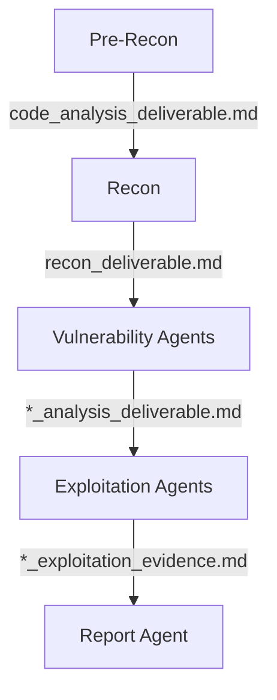

Shannon is built on several core design patterns that ensure modularity, reliability, and extensibility. Understanding these patterns is essential for contributing to or extending Shannon.

## Core Design Principles

<CardGroup cols={2}>
  <Card title="Configuration-Driven" icon="gear">
    YAML configs with JSON Schema validation drive testing behavior
  </Card>
  <Card title="Progressive Analysis" icon="stairs">
    Each phase builds on deliverables from previous phases
  </Card>
  <Card title="SDK-First" icon="wand-magic-sparkles">
    Claude Agent SDK handles autonomous AI execution
  </Card>
  <Card title="Modular Error Handling" icon="triangle-exclamation">
    Explicit Result types and error classification
  </Card>
</CardGroup>

## Configuration-Driven Design

Shannon's behavior is driven by YAML configuration files validated against JSON Schema.

### Benefits

- **Type safety**: JSON Schema ensures configurations are valid before execution
- **Flexibility**: Change testing behavior without code changes
- **Reproducibility**: Configurations can be versioned and shared
- **Documentation**: Schema serves as configuration documentation

### Implementation

```typescript src/config-parser.ts
export async function parseConfig(configPath: string): Promise<AppConfig> {
  // 1. Load YAML file
  const yamlContent = await fs.readFile(configPath, 'utf-8');
  const rawConfig = yaml.load(yamlContent);

  // 2. Validate against JSON Schema
  const validate = ajv.compile(configSchema);
  if (!validate(rawConfig)) {
    throw new PentestError(
      'CONFIGURATION_ERROR',
      'CONFIG_VALIDATION_FAILED',
      `Schema validation failed: ${ajv.errorsText(validate.errors)}`
    );
  }

  // 3. Security validation (path traversal, dangerous patterns)
  validateSecurityConstraints(rawConfig);

  return rawConfig as AppConfig;
}
```

### Configuration Schema

The schema (`configs/config-schema.json`) defines:
- Required vs. optional fields
- Type constraints (string, number, array, object)
- Enum values (login_type, rule types)
- Pattern validation (URLs, file paths)
- Custom validation (credential requirements)

<Note>
  Changes to configuration structure require updating both the schema and TypeScript types in `src/types/config.ts`.
</Note>

## Progressive Analysis Pattern

Each agent builds on the deliverables from previous agents, creating a knowledge accumulation system.

### Analysis Flow



### Benefits

- **Efficiency**: Later agents don't repeat earlier work
- **Context**: Each agent has full history of previous findings
- **Specialization**: Agents focus on their specific task
- **Reproducibility**: Intermediate results can be inspected

### Implementation

Agents reference previous deliverables in prompts:

```markdown prompts/vuln-injection.txt
## Prerequisites

You have access to these deliverables from previous agents:

1. **code_analysis_deliverable.md** - Source code structure and technologies
2. **recon_deliverable.md** - Attack surface map with all endpoints

Review both deliverables to understand the application before starting analysis.
```

The MCP `save_deliverable` tool saves to `deliverables/` directory in the repository, making files accessible to subsequent agents.

## SDK-First Pattern

Shannon delegates autonomous execution to the Claude Agent SDK rather than scripting agent behavior.

### Benefits

- **Autonomy**: Agents can explore, adapt, and make decisions
- **Tool use**: Agents can use browsers, CLI tools, and APIs naturally
- **Reasoning**: Multi-turn reasoning about vulnerabilities
- **Flexibility**: Handles unexpected application behaviors

### Implementation

```typescript src/ai/claude-executor.ts
export async function executeAgent(
  agentName: AgentName,
  prompt: string,
  sourceDir: string,
  logger: ActivityLogger
): Promise<ClaudePromptResult> {
  // Configure Claude SDK
  const result = await query({
    system: prompt,
    messages: [],
    model: modelName,
    maxTurns: 10_000,  // Allow deep exploration
    bypassPermissions: true,  // Auto-approve MCP tools
    mcpServers: buildMcpServers(sourceDir, agentName, logger),
  });

  return result;
}
```

Agents can:
- Execute browser automation (Playwright MCP)
- Run shell commands (file system access)
- Save deliverables (custom MCP tool)
- Generate TOTP codes (custom MCP tool)

### Multi-Turn Execution

```typescript
maxTurns: 10_000  // Up to 10,000 AI→Tool→AI cycles
```

This allows agents to:
1. Read source code
2. Form hypotheses about vulnerabilities
3. Test hypotheses with browser automation
4. Refine payloads based on responses
5. Document findings
6. Iterate until objective is met

## Modular Error Handling

Shannon uses explicit error types and Result patterns instead of exceptions.

### Error Classification

```typescript src/services/error-handling.ts
export class PentestError extends Error {
  constructor(
    public readonly code: ErrorCode,
    public readonly type: PentestErrorType,
    message: string,
    public readonly context?: Record<string, unknown>
  ) {
    super(message);
  }
}

export enum ErrorCode {
  // Non-retryable errors
  AUTHENTICATION_ERROR = 'AUTHENTICATION_ERROR',
  PERMISSION_ERROR = 'PERMISSION_ERROR',
  INVALID_REQUEST = 'INVALID_REQUEST',
  CONFIGURATION_ERROR = 'CONFIGURATION_ERROR',
  
  // Retryable errors
  RATE_LIMIT_ERROR = 'RATE_LIMIT_ERROR',
  NETWORK_ERROR = 'NETWORK_ERROR',
  TIMEOUT_ERROR = 'TIMEOUT_ERROR',
  EXECUTION_ERROR = 'EXECUTION_ERROR',
}
```

### Result Type Pattern

Services return explicit `Result<T, E>` types:

```typescript src/services/agent-execution.ts
export async function execute(
  agentName: AgentName,
  input: ActivityInput,
  logger: ActivityLogger
): Promise<Result<AgentMetrics, PentestError>> {
  try {
    // Execute agent
    const metrics = await runAgent(agentName, input, logger);
    return { ok: true, value: metrics };
  } catch (error) {
    const pentestError = classifyError(error);
    return { ok: false, error: pentestError };
  }
}
```

Activities unwrap Results and throw for Temporal retry:

```typescript src/temporal/activities.ts
export async function runAgentActivity(
  agentName: AgentName,
  input: ActivityInput
): Promise<AgentMetrics> {
  const result = await agentExecutionService.execute(agentName, input, logger);
  
  if (!result.ok) {
    // Throw classified error for Temporal retry
    throw result.error;
  }
  
  return result.value;
}
```

### Benefits

- **Explicit failures**: Forces handling of error cases
- **Type safety**: TypeScript enforces error checking
- **Retry control**: Classification determines retry behavior
- **Context**: Errors carry diagnostic information

## Services Boundary Pattern

Business logic lives in `src/services/`, isolated from Temporal orchestration.

### Architecture

```
src/temporal/           # Orchestration layer (Temporal-specific)
├── workflows.ts        # Workflow orchestration
├── activities.ts       # Thin activity wrappers
└── worker.ts          # Temporal worker

src/services/          # Business logic layer (Temporal-agnostic)
├── agent-execution.ts  # Agent execution logic
├── config-loader.ts    # Configuration loading
├── prompt-manager.ts   # Prompt template management
├── error-handling.ts   # Error classification
└── container.ts       # Dependency injection
```

### Benefits

- **Testability**: Services can be unit tested without Temporal
- **Modularity**: Business logic is reusable outside workflows
- **Portability**: Could swap Temporal for another orchestrator
- **Clarity**: Separation of concerns between orchestration and logic

### Implementation

Activities are thin wrappers:

```typescript src/temporal/activities.ts
export async function runInjectionVulnAgent(
  input: ActivityInput
): Promise<AgentMetrics> {
  // 1. Initialize services
  const logger = new TemporalActivityLogger('injection-vuln');
  const container = createServiceContainer(input.repoPath);
  const agentService = container.get('agentExecution');

  // 2. Heartbeat for Temporal
  const heartbeatInterval = setInterval(() => {
    Context.current().heartbeat();
  }, 30_000);

  try {
    // 3. Delegate to service
    const result = await agentService.execute('injection-vuln', input, logger);
    
    if (!result.ok) {
      throw result.error;  // Service error → Temporal error
    }
    
    return result.value;
  } finally {
    clearInterval(heartbeatInterval);
  }
}
```

<Note>
  Activities should only handle: heartbeats, error classification, and service delegation. All business logic belongs in `src/services/`.
</Note>

## Dependency Injection Pattern

Services are wired together via a DI container for testability and modularity.

### Container

```typescript src/services/container.ts
export function createServiceContainer(repoPath: string): ServiceContainer {
  const configLoader = new ConfigLoader(repoPath);
  const promptManager = new PromptManager();
  const errorHandler = new ErrorHandler();
  
  const agentExecution = new AgentExecutionService(
    configLoader,
    promptManager,
    errorHandler
  );
  
  return {
    get(serviceName: ServiceName) {
      switch (serviceName) {
        case 'agentExecution': return agentExecution;
        case 'configLoader': return configLoader;
        case 'promptManager': return promptManager;
        default: throw new Error(`Unknown service: ${serviceName}`);
      }
    }
  };
}
```

### Benefits

- **Testability**: Mock dependencies in unit tests
- **Flexibility**: Swap implementations without changing consumers
- **Lifecycle**: Single source of truth for service instances
- **Type safety**: ServiceName enum ensures valid lookups

### Exclusion: AuditSession

`AuditSession` is **not** in the DI container because:
- Per-agent lifecycle (not per-workflow)
- Mutex for parallel safety
- Created inline in activities

```typescript src/temporal/activities.ts
const auditSession = new AuditSession(input.sessionId, agentName);
await auditSession.logAgentStart();
```

## Additional Patterns

### Factory Functions

```typescript src/session-manager.ts
function createVulnValidator(vulnType: VulnType): AgentValidator {
  return async (sourceDir: string, logger: ActivityLogger): Promise<boolean> => {
    try {
      await validateQueueAndDeliverable(vulnType, sourceDir);
      return true;
    } catch (error) {
      logger.warn(`Queue validation failed for ${vulnType}: ${error.message}`);
      return false;
    }
  };
}
```

### Single Source of Truth

The `AGENTS` registry is the single source of truth for agent configuration:

```typescript
export const AGENTS: Readonly<Record<AgentName, AgentDefinition>> = Object.freeze({...});
```

Derived data structures reference this registry:
- `AGENT_PHASE_MAP`: Maps agents to phases
- `AGENT_VALIDATORS`: Maps agents to validation functions
- `MCP_AGENT_MAPPING`: Maps prompts to MCP servers

### Immutability

```typescript
export const AGENTS: Readonly<Record<AgentName, AgentDefinition>> = Object.freeze({...});
```

- `Object.freeze()`: Prevents runtime mutations
- `Readonly<>`: TypeScript compile-time immutability
- `const`: Prevents reassignment

## Best Practices

<CardGroup cols={2}>
  <Card title="Single Responsibility" icon="bullseye">
    Each module/service/agent should have one clear purpose
  </Card>
  <Card title="Explicit Over Implicit" icon="eye">
    Use explicit types (Result, ErrorCode) over implicit behavior (exceptions)
  </Card>
  <Card title="Boundary Enforcement" icon="shield">
    Keep orchestration (Temporal) separate from business logic (services)
  </Card>
  <Card title="Immutable Data" icon="lock">
    Prefer readonly data structures for configuration and constants
  </Card>
</CardGroup>

## Next Steps

<CardGroup cols={2}>
  <Card title="Code Style" icon="code" href="/development/code-style">
    Follow Shannon's coding conventions
  </Card>
  <Card title="Adding Agents" icon="plus" href="/development/adding-agents">
    Apply patterns when creating new agents
  </Card>
  <Card title="Error Handling" icon="triangle-exclamation" href="/development/error-handling">
    Complete error handling reference
  </Card>
  <Card title="Architecture Overview" icon="sitemap" href="/development/architecture-overview">
    High-level system architecture
  </Card>
</CardGroup>
